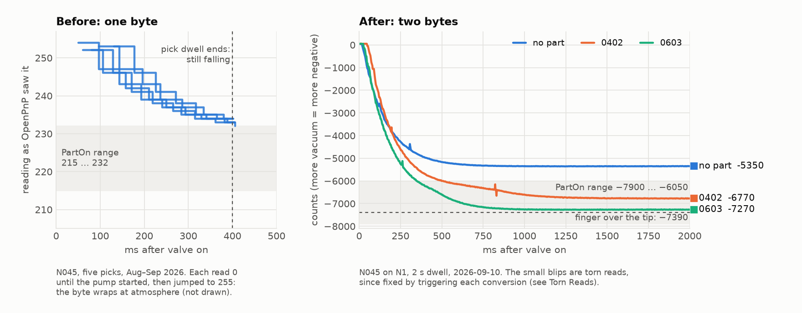
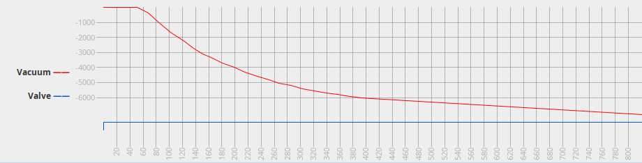
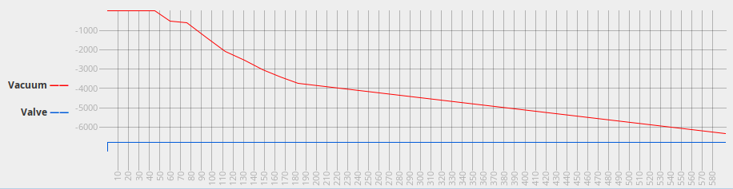
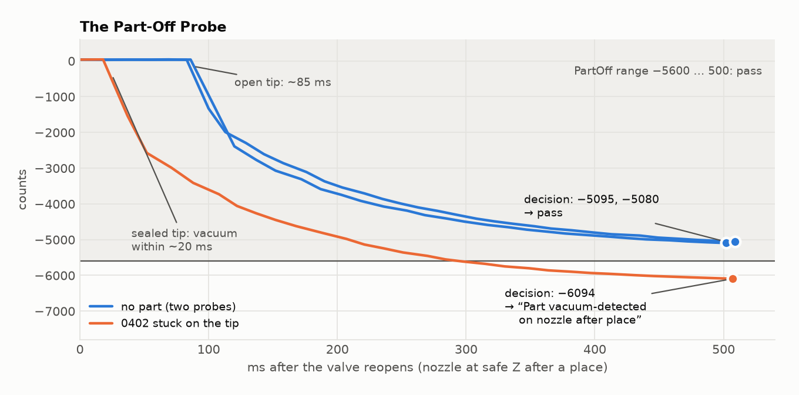

# Vacuum Sensing on the LumenPnP

The LumenPnP's vacuum sensor is a 24-bit pressure sensor. The stock OpenPnP config reads
**eight bits of it**. On this machine that left an 0402 with **6 counts** of signal, part
detection that failed whenever a pick landed in the 3-count gap, and part-off detection
switched off entirely.

Reading two bytes instead of one gives **256× the resolution**, and the same 0402 now shows
**1400 counts** of signal. Along the way this turned up a torn-read bug, a pick dwell that had
never once let the vacuum settle, and enough margin to turn on stuck-part detection, which has
already caught a real stuck 0402.



The working history is in issues
[#22](https://github.com/NatCrutcher/lumenpnp_nwc/issues/22) (the read) and
[#23](https://github.com/NatCrutcher/lumenpnp_nwc/issues/23) (part-off detection).

## Short Version

- **Change `M261 A109 B1 S2` to `B2 S2`** in both vacuum read commands. Not `B3`.
- **Trigger a conversion before each read** so the two bytes always come from the same
  measurement. The full read command is in [The Config](#the-config).
- **Re-derive every threshold.** The old numbers are meaningless on the new scale, and "Low"
  is now the *high-vacuum* end, because more vacuum reads more negative.
- **Look at the settling curve before you pick a dwell.** The stock 400 ms pick dwell ended
  every recorded pick while the vacuum was still falling.

## The Sensor

Each head has a digital pressure sensor at I²C address **0x6D** (`A109`) behind a multiplexer at
**0x70** (`A112`; control byte `B1` selects VAC1, `B2` selects VAC2). The register map matches CFSensor's
**XGZP6857D** family:

| Register | Contents |
|---|---|
| `0x06` / `0x07` / `0x08` | Pressure, MSB / CSB / LSB: a signed 24-bit value |
| `0x30` | Command: sleep time, start-of-conversion, measurement mode |
| `0xA6` | Oversampling and gain, factory-set (leave it alone) |

OpenPnP reaches it through Marlin's `M260` (I²C write) and `M261` (I²C read). The value
OpenPnP sees is whatever `M261` prints after `data:`, parsed as a plain number with no scaling.

## One Byte

The stock read command:

```gcode
M260 A112 B1 S1  ; select VAC1 on the multiplexer
M260 A109 B6 S1  ; point at register 0x06 (pressure MSB)
M261 A109 B1 S2  ; read one byte, print in style 2
```

Style 2 in Marlin's `TWIBus::echodata` assembles a **signed int16 from two bytes**. With `B1`
it gets only one, fills in the low half, and prints the MSB alone as 0–255. So OpenPnP saw
the top 8 bits of a 24-bit sensor. Across 34 log files there were **29 distinct values in
total**, and the byte **wraps at atmosphere**: 0 with the pump off, then 255, 254, … as vacuum
builds. That's why every "before" curve above starts near 255, after a run of zeros left off
the chart.

## Two Bytes

```gcode
M261 A109 B2 S2  ; read MSB + CSB as a signed int16
```

The sensor auto-increments its register pointer, so a two-byte read from `0x06` returns MSB and
CSB, and style 2 prints them as a proper signed number. Atmosphere now reads about +50, and
vacuum goes smoothly negative with no wraparound. Each new count is 1/256 of an old one: the
old reading was simply the new one's high byte.

**Don't use `B3`.** Style 2 keeps only the *last two* bytes it receives, so `B3` returns CSB and
LSB, silently dropping the MSB.

Nothing else in OpenPnP needs to change. The stock regex `^.*data:(?<Value>.*)` keeps the minus
sign, and negative thresholds work fine in the range checks and graphs.

## Torn Reads

The stock `CONNECT_COMMAND` puts the sensor in *sleep-mode conversion*: it measures on its own
every 62.5 ms. (We measured a 47 ms period, about 21 samples/s.) That's coarse enough to turn
the settling curve into a staircase, so the obvious next step was sleep time 0: back-to-back
conversions, about 200/s.

That caused a new problem. When a conversion finishes *between* the two bytes of a read, you
get the old MSB glued to the new CSB:

```
reading  -6389   -6152   -6408
hex       E70B   E7|F8    E6F8     ← high byte from one conversion, low byte from the next
```

The error is up to ±255 counts, which is small on the graph but not harmless. The tears cluster
on the ramp, where the high byte changes most often, and that is exactly where Establish Level
decides whether the part is on. At sleep time 0 we logged six tears in six picks.

The datasheet's alternative is single-shot: write `0x0A` to the command register to start one
combined conversion, wait, then read. Once the conversion is done, nothing changes the data
registers, so the read can't tear. A 10 ms wait (the datasheet suggests "poll the done bit or
hold 20 ms"; conversions measured under 5 ms) gives **62 samples/s**, with no torn reads and no
stale ones.

| Mode | New data every | Torn reads |
|---|---|---|
| Stock, sleep-mode 62.5 ms | 47 ms (21/s) | possible, none seen |
| Sleep-mode, sleep time 0 | ~5 ms | ~1 per pick |
| **Triggered, `G4 P10`** | **16 ms (62/s)** | **none** |

`bin/vacuum-log` in this repo flags tears automatically: an out-and-back spike that differs
from a neighbour by almost exactly a multiple of 256.

## The Config

In **Machine Setup → Driver → GcodeDriver → Gcode**, the `ACTUATOR_READ_COMMAND` for VAC1 (use
`B2` on the first line for VAC2):

```gcode
M260 A112 B1 S1  ; select VAC1 on the multiplexer
M260 A109 B48    ; command register 0x30
M260 B10 S1      ; 0x0A: start one combined conversion
G4 P10           ; wait for it to finish
M260 A109 B6 S1  ; point at register 0x06 (pressure MSB)
M261 A109 B2 S2  ; read MSB + CSB as a signed int16
```

In `CONNECT_COMMAND`, change each sensor's `M260 B27` (sleep-mode, 62.5 ms) to `M260 B10` (one
conversion), since every read now starts its own.

The `ACTUATOR_READ_REGEX` stays `^.*data:(?<Value>.*)`.

## What the Numbers Mean

Levels are raw counts: the top 16 bits of the 24-bit reading. If your sensor is the
±100 kPa variant, the datasheet's scale factor makes one count about 4 Pa, so −7400 is roughly
−30 kPa. That's unverified here, and only the relative numbers matter for part detection.

Levels on this machine, after 2 s of vacuum:

| | Open | 0402 | 0603 | k05 (VQFN-24) | Finger |
|---|---|---|---|---|---|
| **N045** (VAC1) | −5353 | −6764 | −7268 | — | −7390 |
| **N24** (VAC2) | −1056 | — | — | −6865 | −7237 |

- **Noise** is about σ 4–8 counts, up to 14 for the 0402, the leakiest seal. The smallest
  signal, 0402 against open, is 1400 counts.
- **Atmosphere** reads +33 … +66, a small positive offset that differs slightly between the
  two sensors.
- **Dead time:** 20–85 ms from the valve/pump command to the first sign of vacuum, longest
  with an open tip.
- **Settling** (within 100 counts of final) is slow: ~590 ms for an open N045, ~770 ms for an
  0603, ~1100 ms for an 0402. An open N24 is done in ~175 ms, since its big orifice barely
  holds any vacuum.
- **Venting:** after a place, the line is back at atmosphere within 150 ms of the valve
  closing.

That settling time is the second finding. The old 400 ms pick dwell never saw a plateau, so
every old reading was a sample off a moving ramp. Across 68 full-dwell N045 picks, the final
reading ranged from 231 to 237: a 6-count spread, as big as the 0402's entire signal.

## Part-On Detection

Part-on detection lives in **Machine Setup → Nozzle Tips → *tip* → Part Detection**. The
settings on this machine:

| Tip | Method | Vacuum Range (Low … High) | Establish Level | Pick dwell |
|---|---|---|---|---|
| N045 | Absolute | −7900 … −6050 | on | 800 ms |
| N24 | Absolute | −7800 … −3500 | on | 500 ms |

The N045 High of −6050 sits midway between an open tip and a seated 0402, about 700 counts
from each. Every margin is well over the 255 counts a torn read could have added.

**Low and High are numeric, not "low vacuum" and "high vacuum".** More vacuum is more
negative, so **Low is the sealed end**. It's easy to enter these backwards.

With Establish Level on, OpenPnP stops waiting as soon as the level enters the range. This
graph from OpenPnP shows it:



The curve stops at about 400 ms, the moment the 0603 crossed −6050. The straight line out to
about 820 ms isn't data: it's OpenPnP joining that point to the after-pick check, a single read
taken once the nozzle has retracted to safe Z. By then the vacuum has kept building. On N24,
the k05 crosses at about 183 ms:



## Establish Level

Establish Level turns a fixed dwell into a **dwell with an early exit**.

- **On the pick side, use it.** The pick dwell becomes a timeout: good seals finish early
  (0603 ~400 ms, k05 ~200 ms), and slow seals get the whole window. You only pay the full
  timeout on a failed pick, so be generous with it. It also records the Part Detection graph.
- **On the place side, leave it off.** OpenPnP uses the *same* PartOff range for two different
  measurements: the vacuum decaying during the place (valve closed), and the part-off probe
  (valve open, described next). A range tuned for the probe is reached during the place decay
  while the line still holds thousands of counts of vacuum, so the nozzle would lift early.
  Use a fixed place dwell instead. The line vents in under 150 ms.

## Part-Off Detection

Part-off asks the opposite question after a place: *did the part actually leave?* A part stuck
to the tip is otherwise invisible, and the job carries on placing with it attached.

The check is an active probe, not a passive read. At safe Z after the place, OpenPnP **reopens
the valve** for *Probing Time*, closes it, waits *Dwell Time*, and reads. It's tempting to
treat this as a leak-down test, where you close the valve and see whether the vacuum holds.
**On the LumenPnP that doesn't work:** closing the valve vents the line to atmosphere whether a
part is on the tip or not. So set **Dwell Time to 0**. OpenPnP then decides on the last reading
taken with the valve open: an open tip reads "no part", a sealed one reads "part".



That orange curve is a real stuck 0402. It was caught and stopped the job. A sealed tip also
starts pulling vacuum within ~20 ms, against ~85 ms for an open one.

| Tip | Method | Range (Low … High) | Probing Time | Dwell Time | Checked |
|---|---|---|---|---|---|
| N045 | Absolute | −5600 … 500 | 500 ms | 0 | after place |
| N24 | Absolute | −2500 … 500 | 250 ms | 0 | after place, before pick |

The N045 probe is long because it has the smallest margin: at 500 ms an open tip reads about
−5100 and a stuck 0402 about −6100. The probe costs its full length on every placement.

**Where's the graph?** The Part Detection tab only shows the part-off graph when Establish
Level (part-off) is ticked or the method is Difference. With Absolute and Establish Level off,
which is the right setting as explained above, the graph is hidden even though OpenPnP still
records it. `bin/vacuum-log` gets the probe curves back out of the log.

## When to Check

OpenPnP offers five check points. Each part-on check is a single read, about 16 ms. A part-off
check is a full probe.

| Check | Where the nozzle is | Cost | Catches |
|---|---|---|---|
| Part-on after pick | Retracted from the feeder | 1 read | Missed picks: the essential one |
| Part-on after alignment | Stopped at the bottom camera | 1 read | Parts lost on the way to the camera, or knocked off during vision |
| Part-on before place | About to move to the board | 1 read | Parts lost while another nozzle placed |
| Part-off after place | Retracted from the board | 1 probe | Parts stuck to the tip |
| Part-off before pick | Before going to the feeder | 1 probe | Leftovers from aborted jobs or manual moves |

A job cycle picks with every nozzle, aligns every part, then places each one. So the
before-place check on the second nozzle comes after the first nozzle has gone to the board and
back.

**Can it check while moving to bottom vision?** Not in stock OpenPnP. Each check is one read
at a fixed step, and the vacuum actuators are set to wait for the machine to stop before
reading. But the after-alignment check happens while the nozzle is already stopped at the
camera, and a read now takes only 16 ms, so it's close to free. Turning it on is a good
cheap upgrade.

Part-off is the expensive one: a full probe per placement. It earns its time on small parts,
which is where sticking is both likeliest and hardest to spot.

## OpenPnP Gotchas

These apply to OpenPnP 2.6 and are true on any machine, not just a LumenPnP:

- **Difference mode still range-checks the baseline** against the *Absolute* range. Leave that
  at `0 … 0` and every check fails before the difference is even looked at.
- **Difference ranges are signed.** Picking a part makes the reading go *down*, so the range is
  negative.
- **One PartOff range serves both the place dwell and the probe**, so you can't tune Establish
  Level and the probe independently. See [Establish Level](#establish-level).
- **The part-off graph is hidden** with Absolute and Establish Level off. The probe also decides
  whether to record at all using the part-on settings, not the part-off ones.
- **A detected stuck part isn't discarded or retried.** `place()` clears the nozzle's part
  *before* the part-off check runs, so OpenPnP believes the nozzle is empty. The job stops,
  which is the point, but you clear the part by hand. Tracked in
  [#23](https://github.com/NatCrutcher/lumenpnp_nwc/issues/23) and
  [#33](https://github.com/NatCrutcher/lumenpnp_nwc/issues/33).

## Try It Yourself

1. Change the read command and `CONNECT_COMMAND` as in [The Config](#the-config). Read VAC1 and
   VAC2 in **Machine Controls → Actuators**: about +50 with the pump off, a few thousand
   negative with it on, more negative with a finger over the tip.
2. Set **Method Part On** to *None* on every tip. The old ranges will fail every pick.
3. **Record a full curve** for each tip: set Method to *Difference*, untick Establish Level,
   set both ranges to −32000 … 32000, and set the pick dwell to 2000 ms. Difference with
   Establish Level off samples for the whole dwell with no early exit. Pick nothing, then a
   small part, then a big one, and screenshot each graph.
4. Put **High** midway between the open level and your smallest part's level, and **Low**
   below your finger reading. Switch back to *Absolute* with Establish Level on, and set the
   pick dwell to comfortably past where the smallest part enters the range.
5. For part-off, set **Dwell Time to 0**, then find the probe time where an open tip and a
   stuck part are well separated. Holding a finger on the tip at safe Z right after a place is
   a decent stand-in for a stuck part.

## Still Open

- **Twenty consecutive 0402 picks** without a false "no part", which is the acceptance test in
  #22. The 0402 entered range at 530–610 ms against an 800 ms timeout, so the timeout may need
  to go to 1000 ms.
- **A shorter part-off probe.** The open and stuck curves are further apart at 200 ms (1220
  counts) than at 500 ms (1000), which suggests a ~250 ms probe with a threshold near −4600
  would work. That's based on one stuck part, though, so it needs more samples first.
- **Place dwell**, currently a temporary 1000 ms. The line vents in under 150 ms, and a
  longer wait doesn't help a part that's sticking for some other reason.
- **Cross-checks:** N045 on N2 and N24 on N1, plus the other four tips.
- **Reporting it to Opulo**, since the one-byte read is in the shipped config.

---

*Figures are regenerated from the CSVs in [`img/vacuum/data/`](img/vacuum/data/SOURCES.md)
by `img/vacuum/make_figures.py`. `bin/vacuum-log` lists every vacuum run in an OpenPnP log.*
